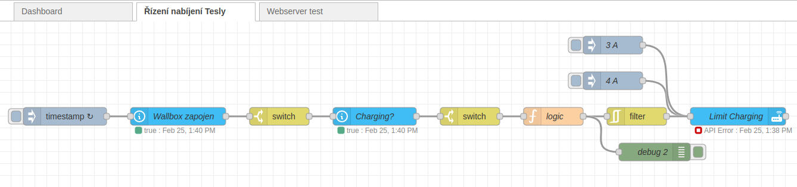

# Tesla-charging
## Jednoduchá automatizace nabíjení vozů Tesla pouze z přebytků výroby fotovoltaické elektrárny

Postaveno s pomocí Home Assistant (sbírá data ze střídače fotovoltaické elektrárny a řídí nabíjecí proud do Tesly) a Node-RED (v něm je zapsána samotná logika výpočtu proudu odpovídajícího aktuálnímu přebytku výroby).

Měl jsem o tom přednášku na OpenAltu 2023 v Brně - zde je [videozáznam](https://www.youtube.com/watch?v=F76nD9Uzy78&list=PLOEQDQruWfhxJlVyNDuyrJ_NTTtuaSTsN&index=8&pp=iAQB) a tady [prezentace v PDF](https://pstehlik.cz/prezent/NabijeniTesla.pdf).

Je to prozatím velmi jednoduchá automatizace, jak vidíte na fotce obrazovky editoru Node-RED:

Pokud máte střídač GoodWe zaintegrován do Home Assistanta (má oficiální doplněk) a dále propojen Home Assistant s Node-RED (v HAOS na pár kliků myši), stačí do Node-RED naimportovat [toto flow](flows.json).

Samotný algoritmus, který počítá, jak silný proud do Tesly poslat, si můžete prohlédnout v [tomto souboru](logic.js).

Pokud je nedostatek sluneční energie, program posílá minimálně 2 ampéry (viz první řádek programu). Jinak balancuje nabíjecí proud do Tesly tak, aby udržoval nabití domácí baterie o 15 % výš než je dolní hranice vybití (viz třetí řádek programu).

Automatické vypnutí nabíjení v podvečer (kdy už je jasné, že slunce už nebude) zatím není uděláno - uživatel musí vypnout nabíjení auta sám (v mobilní aplikaci, v autě nebo přes Home Assistant). V budoucnu zřejmě přidám automatické vypnutí a zapnutí nabíjení podle denního času a dalších parametrů.

Toto flow v Node-RED nabízí i manuální nastavení nabíjecího proudu na 3 nebo 4 ampéry (tak nízký nabíjecí proud mobilní aplikace ani infotainment auta standardně nedovolují).

Jestli máte jiný střídač než od GoodWe, stačí upravit proměnné, ze kterých se čtou informace o přebytcích výroby. Jména proměnných zjistíte v Home Assistantovi.

Jestli nemáte elektromobil od Tesly, potřebujete nejspíš řídit omezení nabíjecího výkonu ve "wallboxu", což je různé typ od typu.
